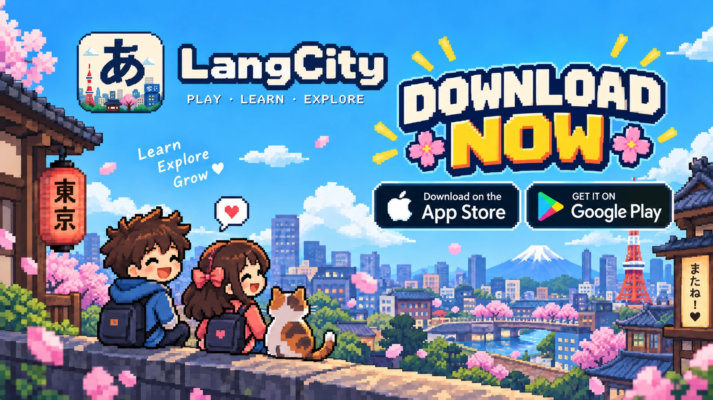

# LangCity · ラングシティ

**Play · Learn · Explore**  
Learn Japanese by living in a pixel-art town. Explore, meet AI characters, complete missions, and grow your language skills one conversation at a time.

### Play LangCity

 

[Website](https://langcity.alphberlin.com/) · [All releases](https://github.com/AlphBerlin/langcity-release/releases)

## Explore a town. Speak Japanese.

Walk through Tokyo-inspired streets, visit shops and stations, and talk to characters in Japanese. Missions give you a reason to practise, while XP and new areas reward your progress. Start as a guest or sign in to sync your journey.

## Downloads and game data

The macOS DMG and Android APK buttons above link to the **v1.0.30 installers**, the newest installer files currently published in this repository. The App Store and Google Play buttons link to the store listings; the Web button opens the browser game.

Newer GitHub releases may also contain `common.zip` and `ja.zip`. Those are **game-content packs used by the app**, not standalone installers. See [all releases](https://github.com/AlphBerlin/langcity-release/releases) for the current release history.
